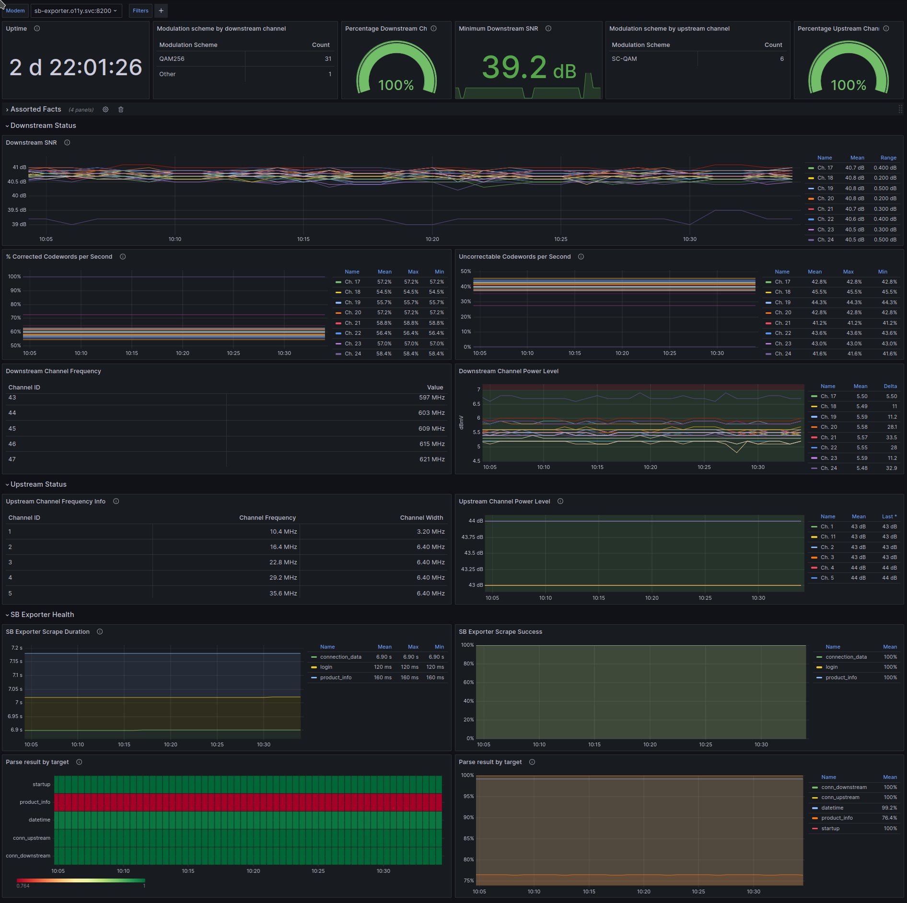

# SB8200 prometheus exporter

[Yet another](#prior-work) SB8200 prometheus exporter.
This implementation does not require a headless browser and exports in prometheus format.
It's simple and meant to be deployed in a k8s cluster but can be run locally; all configuration is done via environment variables.

<!-- maintained with yzhang.markdown-all-in-one -->
- [SB8200 prometheus exporter](#sb8200-prometheus-exporter)
  - [Dashboard](#dashboard)
  - [Prior work](#prior-work)
  - [TODOs](#todos)
  - [Deployment](#deployment)
  - [Development](#development)

## Dashboard

It looks like this:

And the dashboard is in [`dashboards/sb8200.json`](dashboards/sb-exporter.json)

## Prior work

There's a few other projects that do similar things but they're either old/abandoned, require a headless browser, export in a non-prometheus format or target a different modem.

I don't want to run a headless browser in my k8s cluster and I want to use prometheus so I wrote this.

- [https://github.com/sbrudenell/sb8200_exporter](https://github.com/sbrudenell/-sb8200_exporter/)

- [https://github.com/raleighlittles/ArrisCableModemMonitoring](https://github.com/raleighlittles/ArrisCableModemMonitoring)

- [https://github.com/raleighlittles/ArrisCableModemMonitoring](https://github.com/raleighlittles/ArrisCableModemMonitoring)

- [https://github.com/iwvelando/modem-scraper](https://github.com/iwvelando/modem-scraper)

- [arris_exporter command - github.com/christianclinton/arris_exporter/cmd/arris_exporter - Go Packages](https://pkg.go.dev/github.com/christianclinton/arris_exporter@v0.0.0-20181110054855-7f6ab5b91ad2/cmd/arris_exporter)

- [Monitoring Connect Box cable modems with Prometheus and Grafana | MB's Blog](https://mbugert.de/posts/2020-04-19-connectbox-prometheus/)

## TODOs

There's quite a few `#TODO: ...` in the code but they're mostly about polish and making things more robust.

I've got limited time and this is working well for me in my environment so development - other than bug fixes - will be non-existent.

## Deployment

This is meant to be run in a k8s cluster with [Prometheus Operator](https://github.com/prometheus-operator/prometheus-operator).

Example manifest and deployment instructions are in [`infra/k8s`](infra/k8s/readme.md)

## Development

Standard python / poetry project.
To help with dashboard development, there is a [`docker-compose`](dashboards/docker-compose.yaml) file that will start a local instance of prometheus, grafana and the exporter.
